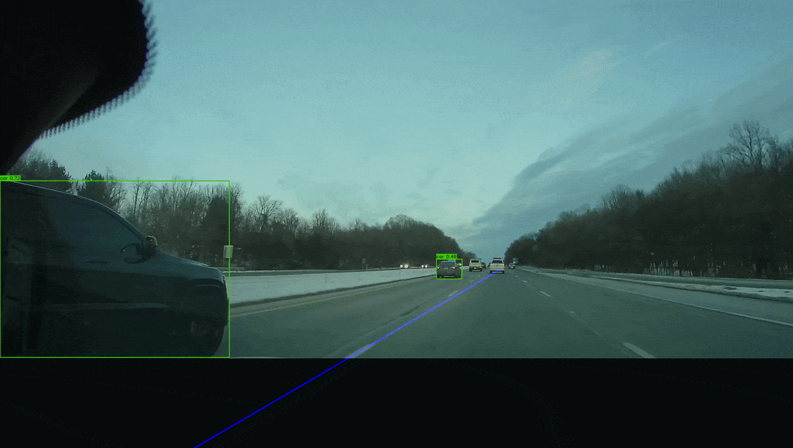

# 🚘 Autonomous Driving Object Detection

A dashcam perception pipeline combining YOLOv8 object detection and classical computer vision for real-time vehicle, pedestrian, and lane identification. Built as a clean implementation of core AV perception techniques — hood masking, Hough transform lane detection, and inference optimization via frame skipping.


---

## Demo


my own 720p dashcam footage at ~18 FPS on CPU with frame skip=2
---

## Features

| Feature | Description |
|---|---|
| 🟢 **Object Detection** | Detects cars, trucks, buses, pedestrians, and traffic lights using YOLOv8 Nano |
| 🔵 **Lane Identification** | Finds left and right lane lines using Canny edge detection + Hough transforms |
| ⚡ **Frame Skipping** | Configurable inference skip rate to balance speed vs. accuracy |
| 🎭 **Hood Masking** | Automatically blacks out the car hood to prevent false detections |
| 🌐 **Web Interface** | Clean Gradio UI with a pre-processed instant demo video |

---

## Tech Stack

- **[YOLOv8 (Ultralytics)](https://github.com/ultralytics/ultralytics)** — Real-time object detection
- **[OpenCV](https://opencv.org/)** — Classical computer vision (Canny, Hough transforms)
- **[Gradio](https://www.gradio.app/)** — Web interface
- **[FFmpeg](https://ffmpeg.org/)** — H.264 video transcoding for browser compatibility

---

## How It Works

Every frame of input video goes through this 4-step pipeline:

```
Input Frame
    │
    ▼
1. Hood Mask        → Black-out the bottom of the frame (specific to this dashcam's mounting position, which captures the car's own hood in the shot)
    │
    ▼
2. Lane Detection   → Canny edges → ROI mask → Hough lines → Average into L/R lanes
    │
    ▼
3. Object Detection → YOLOv8 inference → Draw green bounding boxes
    │
    ▼
4. H.264 Encode     → FFmpeg transcode to H.264 (OpenCV's default output format is not browser-compatible, so this step is required for the video to play in the web UI)
```

### Lane Detection Deep Dive
1. Convert frame to grayscale and apply Gaussian blur
2. Run Canny edge detection to find edges
3. Mask a trapezoidal **Region of Interest** (the road ahead)
4. Use `HoughLinesP` to find line segments within the ROI
5. **Group by slope** — negative slope = left lane, positive = right lane
6. **Average and extrapolate** each group into one solid continuous line

---

## Project Structure

```
object-detection/
├── app.py                  # Gradio web interface
├── detection/
│   ├── __init__.py
│   └── detector.py         # All perception logic (detection + lanes)
├── examples/
│   └── demo.MP4            # Pre-loaded dashcam demo video
├── requirements.txt
├── yolov8n.pt              # YOLOv8 Nano weights (auto-downloaded)
└── README.md
```

---

## Quick Start

### Prerequisites
- Python 3.10+
- macOS / Linux

### Installation

```bash
# 1. Clone the repository
git clone https://github.com/YOUR_USERNAME/object-detection.git
cd object-detection

# 2. Create a virtual environment
python3 -m venv .venv
source .venv/bin/activate   # Windows: .venv\Scripts\activate

# 3. Install dependencies
pip install -r requirements.txt

# 4. Run the app
python app.py
```

Open **http://127.0.0.1:7860** in your browser. The demo video is pre-loaded — just click it for instant results.

---

## Configuration

All tuneable parameters live in `detection/detector.py`:

| Parameter | Location | Default | Description |
|---|---|---|---|
| `HOOD_FRACTION` | `_mask_hood()` | `0.80` | Black-out bottom N% of frame |
| `canny_low` | `_detect_lanes()` | `45` | Canny lower threshold |
| `canny_high` | `_detect_lanes()` | `150` | Canny upper threshold |
| `slope_filter` | `_detect_lanes()` | `0.5` | Min slope to count as a lane |
| `confidence` | UI slider | `0.3` | YOLOv8 detection confidence |
| `frame_skip` | UI slider | `1` | Run inference every Nth frame |


